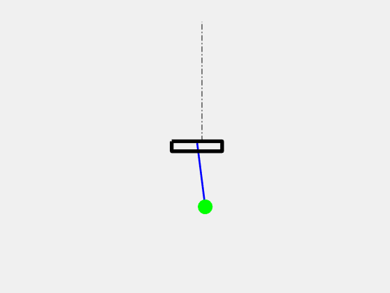

# Energy-based Control of Cart-Pole system
---
Hybrid control combines:
* *Energy-based controller* to swing up Pole from the down position into the up position by pomping energy 

with 

* *Local linear controller* to stabilize pole at the up position. 

## Result

You should obtain the following :

  

---
## Instructions

No toolbox needed to be installed in Matlab.

---

