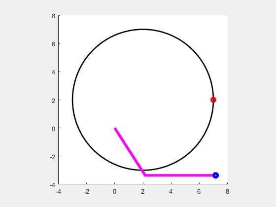

# Crank tracking using kinematic model
---
 In this simulation, fully actuated 2-DoF manipulator robot is controlled using it kinematic model. The robot end effector have to follow a circle path.

The dynamic model is assumed neglected. This assumption stay correcte with low velocities and accelerations.

---
## Instructions

No toolbox needed to be installed in Matlab.

## Result

You should obtain the following :

  

---

