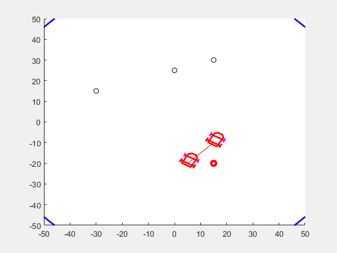

# Goniometric Localization for robots using Kalman filter
---

## Instructions

No toolbox needed to be installed in Matlab.

Run the code for one or two robots with:

```bash
 N = 1  % or 2
 goniometric_localisation(N)
``` 

---

## Result


* Localization of two robot:

<p align="center">
  
</p>

The blue and green ellipses represents Covariance Matrices for each robot which, define the estimation errors.

---


