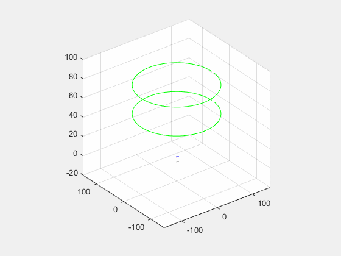
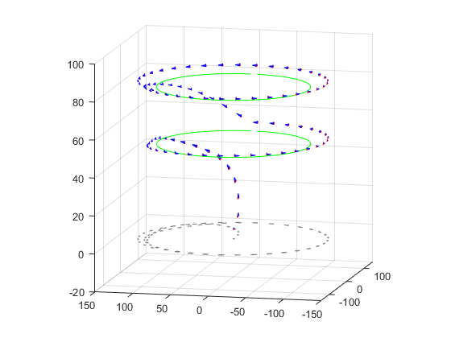

# Plane Altitude Control
---


Control of a small fully autonomous plane. The model used, here, to describe its dynamics, is very strongly inspired by that of
Faser Ultra Stick by *Klein E.M.V. et., al (2006)*

---

## Instructions

No toolbox needed to be installed in Matlab.

Run the code, in the workspace, with:

```bash
 Plane
``` 

---

## Result


* Control the plane to follow two setpoint of Altitude as given in green line in the following figure:

<p align="center">
  
</p>

and 

<p align="center">
  
</p>


---

## References

*  Klein E.M.V. , Aircraft System Identification: Theory And Practice , American Institute
of Aeronautics and Astronautics, 2006.


