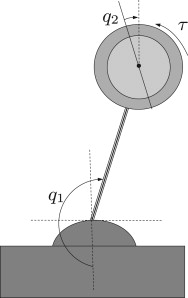

# Reaction Wheel Pendulum Stabilization
---

 The Reaction Wheel Pendulum, as shown in the figure below, is a physical pendulum with an actuated rotating disk attached to the end. 
The coupling torque generated by the angular acceleration of the disk can be used to actively control the pendulum to maintain it standing. This problem is very similar to the tightrope walker stabilization.

  

---
## Instructions

The following Python librairies have to be installed: *math*, *numpy*, *matplotlib* and *scipy*.

---

