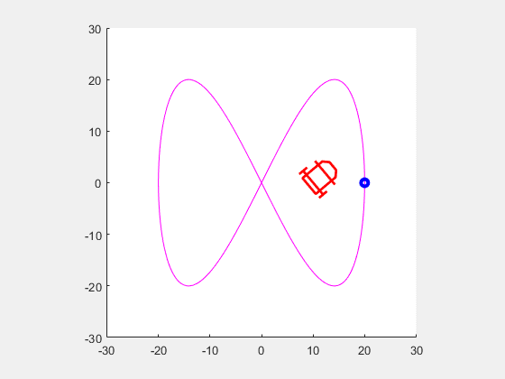

# Sliding Mode Control of a Cart
---
 In this simulation, a sliding mode controller is implemented to make the cart following a desired Lissajou
trajectory.

---
## Instructions

No toolbox needed to be installed in Matlab.

## Result

You should obtain the following :

  

---

