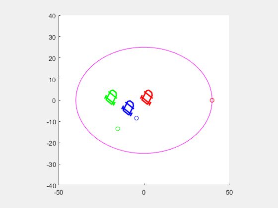

# Train Cars Control using Sliding Mode Controller
---
...

## Instructions

No toolbox needed to be installed in Matlab.

Run the code, in the workspace, with:

```bash
 Train_Cars
``` 

---

## Result


* Tracking Control of circular path in the following figure:

<p align="center">
  
</p>


---


